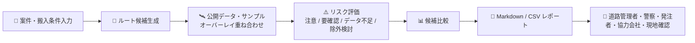
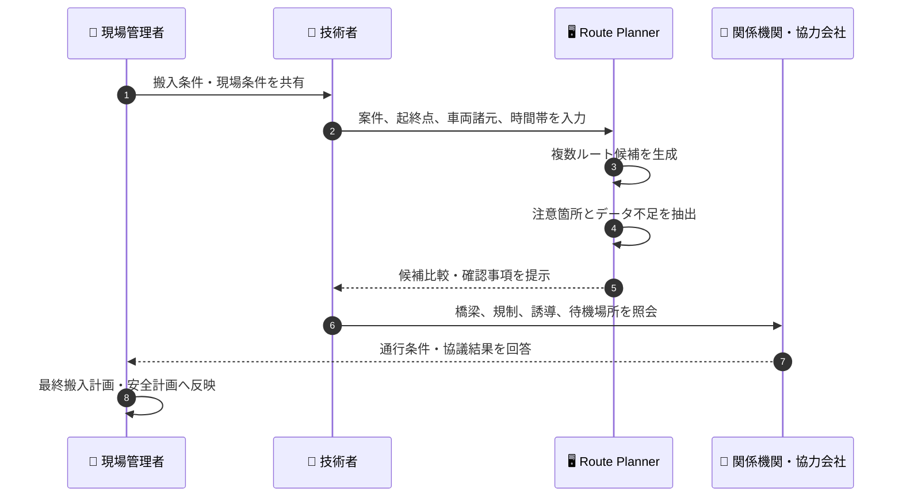
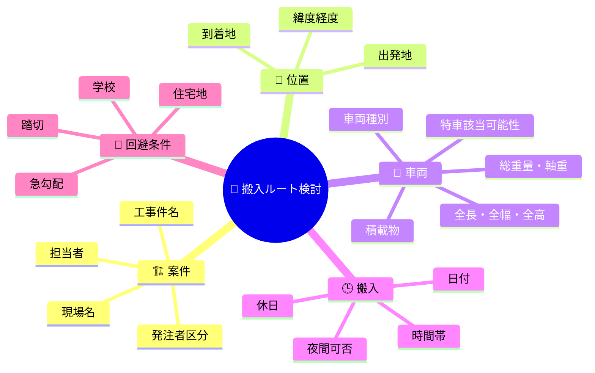
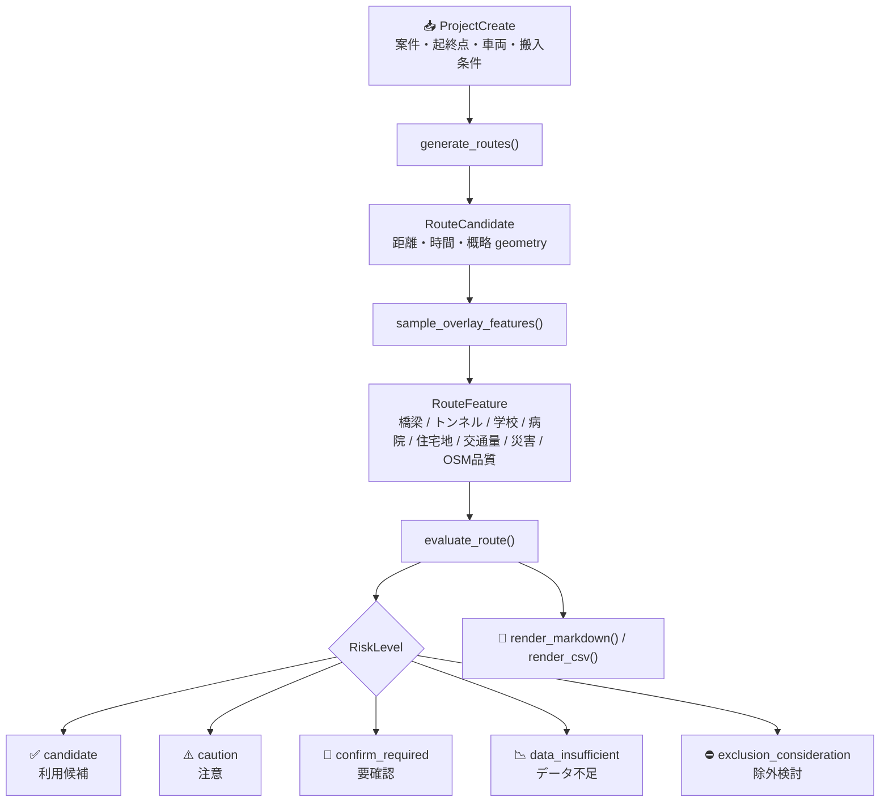
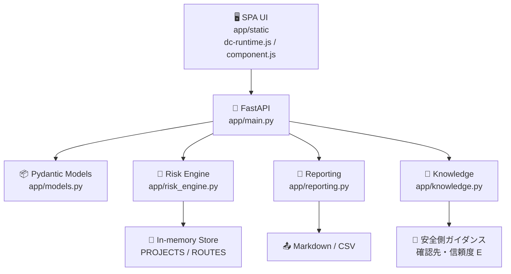
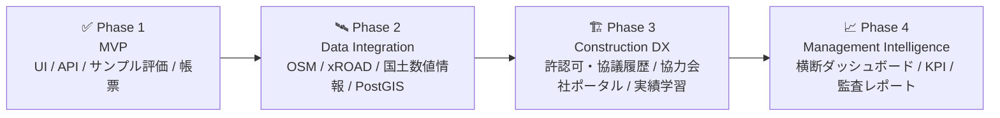

# 🚧 Construction Logistics Route Planner

> 土木・建設工事における **資材搬入・重機回送ルートの初期検討** を支援する MVP です。<br>
> 現場条件、車両諸元、搬入時間帯を入力し、複数の搬入ルート候補、注意箇所、追加確認先、Markdown/CSV レポートを生成します。

[](https://github.com/Kensan196948G/Construction-Logistics-Route-Planner/actions/workflows/ci.yml)


## ⚠️ 重要な前提

このシステムは、**搬入ルートの初期スクリーニングと関係者確認の整理** を目的としています。

| ✅ 支援できること | ❌ 保証しないこと |
|---|---|
| 複数ルート候補の比較 | 通行可否の確定 |
| 橋梁・トンネル・学校・病院・住宅地等の注意抽出 | 特殊車両通行許可の取得可否 |
| データ不足箇所の明示 | 道路使用許可・道路占用許可の成立 |
| 道路管理者・警察・発注者・協力会社への確認事項整理 | 現地安全性・施工実行性の保証 |
| Markdown/CSV による検討メモ出力 | 法令・契約・協議事項の代替判断 |

最終判断には、**道路管理者、警察、発注者、協力会社、現地踏査、最新の規制情報** による追加確認が必要です。

## 🎯 想定利用者

| 👤 利用者 | 主な関心 | README での読みどころ |
|---|---|---|
| 🦺 土木建設現場管理者 | 搬入当日の安全、近隣影響、誘導員配置、待機場所 | [業務フロー](#-業務フロー)、[評価観点](#-評価観点) |
| 🧰 土木建設技術者 | 車両諸元、橋梁・高さ・幅員・時間帯規制、確認先 | [入力条件](#-入力条件)、[API](#-api) |
| 🔬 土木建設研究者 | ルールベース評価、データ品質、GIS/API 連携余地 | [評価ロジック](#-評価ロジック)、[今後の拡張](#-今後の拡張) |
| 🏢 土木建設経営層 | リスクの見える化、属人化低減、協議記録、DX 推進 | [導入価値](#-導入価値)、[MVP の制約](#-mvp-の制約) |

## 💡 導入価値

- 🧭 **搬入計画の初期検討を標準化**<br>
  担当者ごとにばらつきやすい確認観点を、ルート候補・注意箇所・確認先として整理します。

- 🛡️ **安全側の判断を促進**<br>
  OSM 属性不足、橋梁重量、トンネル高さ、学校・病院・住宅地、交通量、災害リスクを「注意」「要確認」「データ不足」「除外検討」で分類します。

- 📄 **協議資料の下書きを即時生成**<br>
  発注者、道路管理者、警察、協力会社との協議に使える Markdown/CSV レポートを出力します。

- 🧪 **研究・PoC に展開しやすい構成**<br>
  FastAPI + Pydantic のシンプルな構成で、PostGIS、外部 GIS、実交通データ、許認可 DB への拡張余地を残しています。

## 🗺️ 全体像



## 🔄 業務フロー



## 🧩 主な機能

| 分類 | 機能 |
|---|---|
| 📝 案件入力 | 工事件名、現場名、担当者、出発地、到着地 |
| 🚚 車両条件 | 車両種別、全長、全幅、全高、総重量、軸重、特殊車両該当可能性 |
| 🕒 搬入条件 | 搬入日、時間帯、休日、夜間搬入可否 |
| 🧭 ルート生成 | 距離優先、時間優先、幹線道路優先、住宅地回避、橋梁・トンネル確認重視 |
| ⚠️ 注意抽出 | 橋梁、トンネル、学校、病院、住宅地、交通量、災害リスク、OSM 属性不足 |
| 📊 評価 | 注意、要確認、データ不足、除外検討、利用候補 |
| 📄 帳票 | Markdown レポート、CSV レポート |
| 🔎 ナレッジ検索 | 搬入計画の論点への安全側ガイダンスと確認先の提示（決定論的・信頼度 E・要レビュー） |
| 🔐 簡易保護 | 任意の API key による基本アクセス制御 |
| 🖥️ UI | 9 画面のシングルページ UI（ダッシュボード / 案件・条件 / ルート・地図 / 搬入リスクメモ / レポート / ナレッジ / 周辺施設辞書 / 管理 / システム） |

## 🖥️ 画面構成

UI は Claude Design のハンドオフ（`Route Planner.dc.html`）を実装した 9 画面のシングルページ構成です。`app/static/dc-runtime.js` がデザインのテンプレート方言（`sc-if` / `sc-for` / `{{ }}` バインディング）を解釈してレンダリングします。

| 画面 | 内容 | バックエンド連携 |
|---|---|---|
| 📊 ダッシュボード | 案件一覧、要確認件数、データソース接続状態、注意箇所内訳 | サンプル表示 |
| 📝 案件・条件入力 | 案件情報、地点・経路、車両・積載、搬入条件、回避条件 | サンプル表示 |
| 🗺️ ルート検討・地図 | ルート候補比較、**実地図（Leaflet + OSM）**、注意箇所ピン、レイヤ切替、確認ステータス更新 | ✅ 背景地図=実データ（OSM）／ルート・ハザードはサンプル |
| 🧾 搬入リスクメモ | 確認チェックリスト、確認先、候補サマリ、注意箇所 | サンプル表示 |
| 📄 レポート出力 | Markdown / CSV / HTML / PDF 相当のプレビュー | サンプル表示 |
| 🔎 ナレッジ検索 | 論点への安全側ガイダンスと確認先 | ✅ `POST /api/knowledge/search` |
| 📍 周辺施設辞書 | 橋梁・トンネル・狭隘・学校・病院・踏切等の辞書とフィルタ | サンプル表示 |
| 🛠️ 管理設定 | データソース、評価重み、評価ルール、ロール、操作ログ | サンプル表示 |
| ⚙️ システム設定 | 表示・処理・通知・セキュリティの各トグル、API キー | サンプル表示 |

> 起動時に `GET /api/health` で接続性を確認し、ナレッジ検索は実 API を呼び出します。ルート検討画面の背景地図は **Leaflet + OpenStreetMap タイル**の実地図です。その他の画面とルート線・注意箇所の位置はサンプルデータで動作する初期検討プロトタイプであり、外部データ・永続化連携は次フェーズの対象です（[MVP の制約](#-mvp-の制約)）。

### 🗺️ 地図（ルート検討画面）

- **Leaflet（vendored: `app/static/vendor/leaflet/`）+ OpenStreetMap タイル**で実地図を表示。`dc-runtime.js` の `data-keep` により、再描画をまたいで地図インスタンスを保持します（レイヤ切替で地図がリセットされません）。
- ルート線・注意箇所は、模式座標を実地理座標へアフィン投影したサンプル表示です（**実ルート探索・実ハザード抽出は次段階**＝README ロードマップ Phase 2）。
- タイルは内部評価向けの低頻度利用を想定。本番は専用タイル提供元（自前ホスト等）の利用が必要です（OSM タイル利用ポリシー）。背景地図には **© OpenStreetMap contributors** を表示。`app/static/component.js` の `afterRender()` で URL を差し替えると**地理院タイル**へ切替できます。

## 🧾 入力条件



## ⚠️ 評価観点

| アイコン | 評価対象 | 代表的な確認事項 | 主な確認先 |
|---|---|---|---|
| 🌉 | 橋梁 | 重量制限、総重量、軸重、老朽橋、迂回要否 | 道路管理者、協力会社 |
| 🚇 | トンネル・アンダーパス | 高さ制限、幅員、離合、冠水履歴 | 道路管理者、現地確認 |
| 🏫 | 学校周辺 | 通学時間帯、歩行者動線、誘導員配置 | 発注者、学校周辺管理者、現地確認 |
| 🏥 | 病院周辺 | 緊急車両動線、騒音、待機、右左折 | 発注者、現地確認 |
| 🏘️ | 住宅地 | 騒音、振動、待機場所、時間帯配慮 | 発注者、協力会社、現地確認 |
| 🚦 | 交通量 | ピーク時間、渋滞、右左折、待機場所 | 協力会社、現地確認 |
| 🌧️ | 災害リスク | 浸水、土砂、荒天時の搬入延期判断 | 防災情報、発注者、現地確認 |
| 🛰️ | データ品質 | OSM 属性不足、制限情報未取得、推定値 | 道路管理者、現地確認 |

## 🧠 評価ロジック

現在の MVP は、外部 GIS/API に接続せず、**deterministic sample overlay** によってリスク候補を生成します。公開データ連携前のプロトタイプとして、確認観点と帳票の形を検証するための実装です。



## 🧱 システム構成



## 🚀 セットアップ

### 1. 仮想環境作成

```bash
python3 -m venv .venv
source .venv/bin/activate
```

### 2. 依存関係インストール

```bash
pip install -e '.[dev]'
```

既に FastAPI / pytest が入っている環境では、そのまま実行できます。

## 🖥️ 起動

```bash
uvicorn app.main:app --reload --port 8000
```

| 種別 | URL |
|---|---|
| 🖥️ UI | http://127.0.0.1:8000/ |
| 📘 API docs | http://127.0.0.1:8000/docs |
| 🩺 Health | http://127.0.0.1:8000/api/health |

既に `8000` が使われている場合は、任意の空きポートを指定します。

```bash
uvicorn app.main:app --port 8017
```

## 🔐 API Key

社内評価環境などで簡易保護を有効にする場合は `APP_API_KEY` を設定します。

```bash
APP_API_KEY='change-me' uvicorn app.main:app --port 8000
```

設定時は、API 呼び出しに次のヘッダーが必要です。`/api/health` と静的 UI は対象外です。

```http
Authorization: Bearer change-me
```

## 🔌 API

| メソッド | パス | 用途 |
|---|---|---|
| `GET` | `/api/health` | サービス状態確認 |
| `GET` | `/api/projects` | 案件一覧 |
| `POST` | `/api/projects` | 案件作成 |
| `GET` | `/api/projects/{project_id}` | 案件詳細 |
| `POST` | `/api/projects/{project_id}/routes/generate` | ルート候補生成 |
| `GET` | `/api/projects/{project_id}/routes` | 案件内ルート一覧 |
| `GET` | `/api/routes/{route_id}` | ルート詳細 |
| `POST` | `/api/routes/{route_id}/evaluate` | リスク評価 |
| `GET` | `/api/routes/{route_id}/risks` | 注意箇所一覧 |
| `GET` | `/api/projects/{project_id}/report?format=markdown` | Markdown レポート |
| `GET` | `/api/projects/{project_id}/report?format=csv` | CSV レポート |
| `GET` | `/api/admin/data-sources` | データソース一覧 |
| `POST` | `/api/knowledge/search` | ナレッジ検索（安全側ガイダンス・確認先・信頼度 E） |

## 📄 レポート出力

Markdown レポートには、以下が含まれます。

- 🏗️ 案件概要
- 🚚 搬入条件
- 🧭 ルート候補比較
- ⚠️ 主な注意箇所
- 👥 追加確認事項
- ⚖️ 注意文

CSV は、案件 ID、ルート ID、距離、時間、リスクレベル、リスクタイトル、確認先、根拠を含みます。協議台帳や BI ツールへの取り込みを想定しています。

## 🧪 検証

ローカルの品質ゲートは、**GitHub Actions CI（`.github/workflows/ci.yml`）と同一**です。`pip install -e ".[dev]"` 後に以下を実行できます。

```bash
ruff check .                        # lint
python3 -m compileall app tests     # 構文・バイトコード確認
pytest                              # API + リスク評価 + ナレッジ検索（12 tests）
bandit -q -r app                    # コードセキュリティスキャン
for f in app.js component.js dc-runtime.js; do node --check "app/static/$f"; done  # クライアント構文確認
python -m build --wheel && python scripts/check_package_assets.py  # 配布物に静的アセット全同梱を検証
```

| 🔁 CI ジョブ | 内容 | ブロッキング |
|---|---|---|
| `quality` | ruff / compileall / pytest / bandit / node --check | ✅ 必須（失敗で merge 不可） |
| `package` | wheel ビルド + 静的アセット同梱検証（`scripts/check_package_assets.py`） | ✅ 必須 |
| `dependency-audit` | `pip-audit .`（プロジェクト依存のみ）＋ JSON レポートを artifact 保存 | ⚠️ advisory（推移的依存の CVE churn で無関係 PR を止めないため非ブロッキング） |

> **`package` ジョブの意義**: editable install（`pip install -e`）はソースツリーから直接 import するため、`pip install .`（Docker デプロイ経路）で wheel に同梱され損ねる `package-data` の取りこぼしを検出できません。非 editable な wheel を実ビルドして vendored Leaflet を含む全アセットの存在を検証します。
>
> **`pip-audit` のスコープ**: `pip-audit .`（プロジェクトパス指定）は **宣言依存（fastapi / uvicorn / pydantic とその推移）のみ** を隔離解決して監査します。`pip-audit` を引数なしで実行すると現在の環境全体（pip-audit 自身の依存を含む）を監査してしまうため、必ずパス指定を使ってください。

依存の脆弱性是正方針・報告窓口・Dependabot 設定は [`SECURITY.md`](SECURITY.md) を参照してください。

UI ランタイム（`dc-runtime.js`）は、9 画面の描画・`sc-if` / `sc-for` 展開・イベント配線・SVG 名前空間・入力フォーカス保持を jsdom ベースのハーネスで確認しています。この環境では Chromium が即時終了するため、ブラウザでのスクリーンショット検証は未実施です（[MVP の制約](#-mvp-の制約)）。

## 🚢 デプロイ

ネイティブ（systemd）とコンテナ（Docker）の 2 系統を用意しています。ポートを分けているため、同一ホストで同時に稼働できます。

| 方式 | ポート | URL | 用途 |
|---|---|---|---|
| 🛠️ systemd（ネイティブ常駐） | `18017` | http://192.168.0.185:18017/ | OS 常駐・自動起動 |
| 🐳 Docker（コンテナ） | `28080` | http://192.168.0.185:28080/ | 隔離・再現可能なデプロイ |

### 🛠️ systemd 登録

user systemd service として登録済みです（`enabled` + linger 有効）。

| 項目 | 値 |
|---|---|
| 🧩 Unit（インストール先） | `~/.config/systemd/user/construction-logistics-route-planner.service` |
| 📄 Unit（リポジトリ雛形） | `deploy/systemd/construction-logistics-route-planner.service` |
| 🔗 Bind | `0.0.0.0:18017` |

```bash
systemctl --user enable --now construction-logistics-route-planner.service   # 登録 + 起動
systemctl --user status  construction-logistics-route-planner.service
systemctl --user restart construction-logistics-route-planner.service
systemctl --user stop    construction-logistics-route-planner.service
journalctl --user -u construction-logistics-route-planner.service -f
```

`loginctl enable-linger kensan` も有効化済みのため、ユーザーセッションがない状態でも起動対象になります。

### 🐳 Docker 登録

`Dockerfile`（非 root 実行・`HEALTHCHECK` 付き）と `docker-compose.yml`（host `28080` → container `8000`）で配信します。

```bash
docker compose build          # イメージ構築
docker compose up -d          # 起動（host 28080 -> container 8000）
docker compose ps             # 状態・health 確認
docker compose logs -f        # ログ追従
docker compose down           # 停止・削除
```

| 項目 | 値 |
|---|---|
| 🏷️ Image | `construction-logistics-route-planner:latest` |
| 📦 Container | `construction-logistics-route-planner` |
| 🔗 Port | `0.0.0.0:28080 -> 8000` |
| 🩺 Health | コンテナ内で `/api/health` を 30 秒間隔監視 |
| 🔐 API Key | `docker-compose.yml` の `APP_API_KEY` を有効化すると `/api/*`（health・knowledge を除く）を保護 |

## 📌 MVP の制約

| 制約 | 現状 | 次フェーズ候補 |
|---|---|---|
| 🛰️ GIS/API | 外部 GIS/API 連携は未接続 | OSM、xROAD、国土数値情報、PLATEAU 等との実連携 |
| 🗄️ 永続化 | プロセス内メモリ保存 | PostgreSQL / PostGIS |
| 🔐 認証認可 | 任意 API key の簡易保護 | Entra ID / OIDC / RBAC |
| 🧾 監査 | 直近イベントのみ保持 | 監査ログ永続化、操作履歴 |
| 📍 ルート精度 | サンプル geometry | 実道路ネットワーク探索、規制属性反映 |
| 🧪 評価根拠 | deterministic sample overlay | 実データキャッシュ、データ品質管理、根拠 URL 保持 |

## 🧭 今後の拡張



## 🧑‍⚖️ 免責

本システムは、公開データに基づく搬入ルートの初期検討支援ツールです。表示されるルート、注意箇所、リスク評価は、通行可否、特殊車両通行許可、道路使用許可、道路占用許可、現地安全性を保証するものではありません。最終判断には、道路管理者、警察、発注者、協力会社、現地確認等による追加確認を行ってください。
