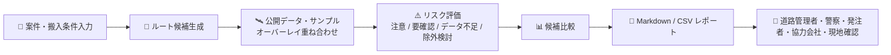
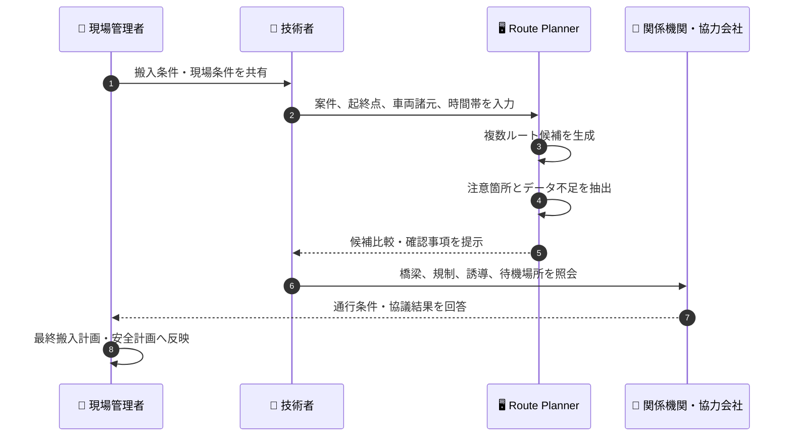
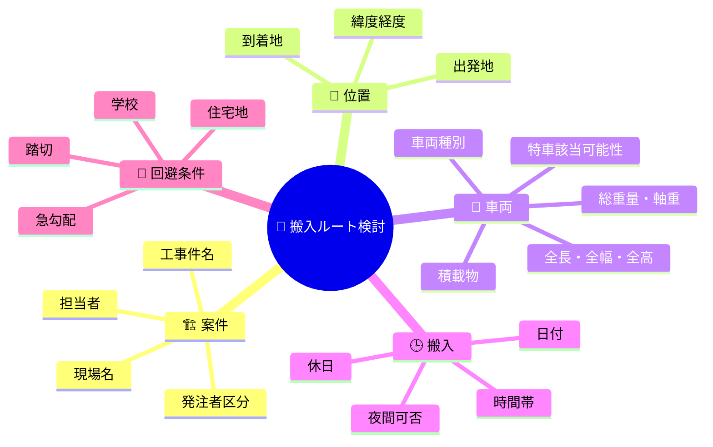
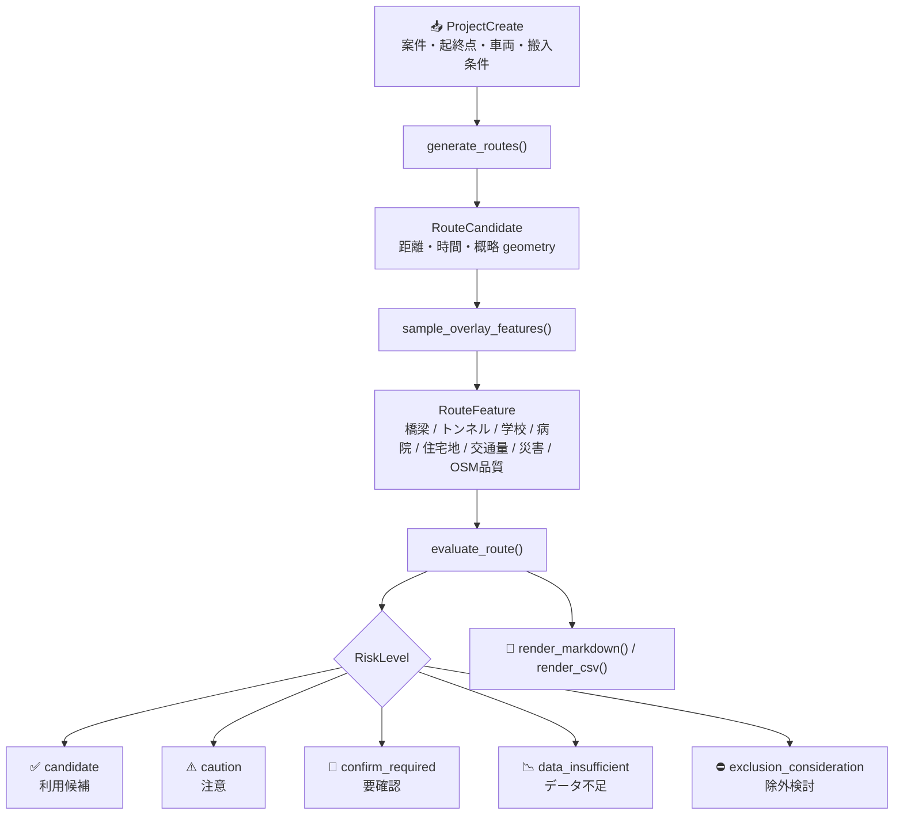
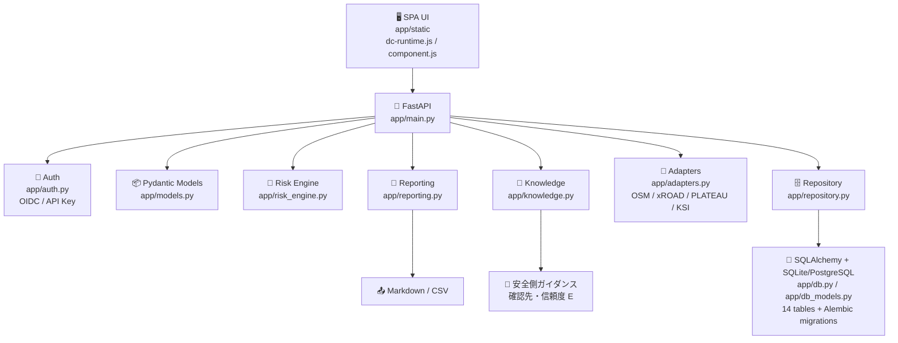
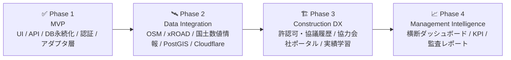

# 🚧 Construction Logistics Route Planner

> 土木・建設工事における **資材搬入・重機回送ルートの初期検討** を支援する MVP です。<br>
> 現場条件、車両諸元、搬入時間帯を入力し、複数の搬入ルート候補、注意箇所、追加確認先、Markdown/CSV レポートを生成します。

[](https://github.com/Kensan196948G/Construction-Logistics-Route-Planner/actions/workflows/ci.yml)


## ⚠️ 重要な前提

このシステムは、**搬入ルートの初期スクリーニングと関係者確認の整理** を目的としています。

| ✅ 支援できること | ❌ 保証しないこと |
|---|---|
| 複数ルート候補の比較 | 通行可否の確定 |
| 橋梁・トンネル・学校・病院・住宅地等の注意抽出 | 特殊車両通行許可の取得可否 |
| データ不足箇所の明示 | 道路使用許可・道路占用許可の成立 |
| 道路管理者・警察・発注者・協力会社への確認事項整理 | 現地安全性・施工実行性の保証 |
| Markdown/CSV による検討メモ出力 | 法令・契約・協議事項の代替判断 |

最終判断には、**道路管理者、警察、発注者、協力会社、現地踏査、最新の規制情報** による追加確認が必要です。

## 🎯 想定利用者

| 👤 利用者 | 主な関心 | README での読みどころ |
|---|---|---|
| 🦺 土木建設現場管理者 | 搬入当日の安全、近隣影響、誘導員配置、待機場所 | [業務フロー](#-業務フロー)、[評価観点](#-評価観点) |
| 🧰 土木建設技術者 | 車両諸元、橋梁・高さ・幅員・時間帯規制、確認先 | [入力条件](#-入力条件)、[API](#-api) |
| 🔬 土木建設研究者 | ルールベース評価、データ品質、GIS/API 連携余地 | [評価ロジック](#-評価ロジック)、[今後の拡張](#-今後の拡張) |
| 🏢 土木建設経営層 | リスクの見える化、属人化低減、協議記録、DX 推進 | [導入価値](#-導入価値)、[MVP の制約](#-mvp-の制約) |

## 💡 導入価値

- 🧭 **搬入計画の初期検討を標準化**<br>
  担当者ごとにばらつきやすい確認観点を、ルート候補・注意箇所・確認先として整理します。

- 🛡️ **安全側の判断を促進**<br>
  OSM 属性不足、橋梁重量、トンネル高さ、学校・病院・住宅地、交通量、災害リスクを「注意」「要確認」「データ不足」「除外検討」で分類します。

- 📄 **協議資料の下書きを即時生成**<br>
  発注者、道路管理者、警察、協力会社との協議に使える Markdown/CSV レポートを出力します。

- 🧪 **研究・PoC に展開しやすい構成**<br>
  FastAPI + Pydantic のシンプルな構成で、PostGIS、外部 GIS、実交通データ、許認可 DB への拡張余地を残しています。

## 🗺️ 全体像



## 🔄 業務フロー



## 🧩 主な機能

| 分類 | 機能 |
|---|---|
| 📝 案件入力 | 工事件名、現場名、担当者、出発地、到着地 |
| 🚚 車両条件 | 車両種別、全長、全幅、全高、総重量、軸重、特殊車両該当可能性 |
| 🕒 搬入条件 | 搬入日、時間帯、休日、夜間搬入可否 |
| 🧭 ルート生成 | 距離優先、時間優先、幹線道路優先、住宅地回避、橋梁・トンネル確認重視 |
| ⚠️ 注意抽出 | 橋梁、トンネル、学校、病院、住宅地、交通量、災害リスク、OSM 属性不足 |
| 📊 評価 | 注意、要確認、データ不足、除外検討、利用候補 |
| ✅ ワークフロー | 案件提出（submit）→ 承認（approve）／差戻し（request-changes）、リスク確認ステータス記録 |
| 📝 案件管理 | 案件一覧の検索・ステータスフィルタ・ページング、編集（PATCH）、論理削除（DELETE → 保管） |
| 📄 帳票 | Markdown レポート、CSV レポート、Excel（xlsx）帳票、PDF レポート |
| 🔎 ナレッジ検索 | 搬入計画の論点への安全側ガイダンスと確認先の提示（決定論的・信頼度 E・要レビュー） |
| 🔐 認証 | Entra ID / OIDC（JWT 検証）または API key によるアクセス制御、4 ロール（admin / planner / site_user / viewer）の RBAC。`PRODUCTION_MODE=1` では認証未設定時に全保護 API を 503 で拒否（フェイルクローズ） |
| 🧾 監査 | 全操作の `audit_logs` 永続化＋admin 向け CSV エクスポート |
| 🖥️ UI | 9 画面のシングルページ UI（ダッシュボード / 案件・条件 / ルート・地図 / 搬入リスクメモ / レポート / ナレッジ / 周辺施設辞書 / 管理 / システム） |

## ⚠️ サンプル表示の明示（本番利用禁止）

現時点のルート候補とリスク地物（橋梁・トンネル・学校・病院・交通量・災害リスク等）は、**実データではなく PoC 用サンプル生成**です。UI 全画面の上部帯、Markdown／CSV 帳票、`/api/health`・ナレッジ応答にその旨を常時表示しています。

本番計画・通行可否・許認可の判断に使用しないでください。`PRODUCTION_MODE=1` を設定してもサンプル生成自体は変わりません（実データ連携が完了してから本番モードを有効にしてください）。

## 🖥️ 画面構成

UI は Claude Design のハンドオフ（`Route Planner.dc.html`）を実装した 9 画面のシングルページ構成です。`app/static/dc-runtime.js` がデザインのテンプレート方言（`sc-if` / `sc-for` / `{{ }}` バインディング）を解釈してレンダリングします。

| 画面 | 内容 | バックエンド連携 |
|---|---|---|
| 📊 ダッシュボード | 案件一覧（検索・ステータスフィルタ・ページング・編集・保管）、KPI、データソース接続状態、注意箇所内訳 | ✅ `GET /api/projects` `/api/projects/stats` |
| 📝 案件・条件入力 | 案件情報、地点・経路、車両・積載、搬入条件、回避条件 | ✅ `POST /api/projects` |
| 🗺️ ルート検討・地図 | ルート候補比較、**実地図（Leaflet + OSM）**、注意箇所ピン、レイヤ切替、確認ステータス更新 | ✅ 背景地図=実データ（OSM）／ルート生成・評価・確認登録は API 連携 |
| 🧾 搬入リスクメモ | 確認チェックリスト、確認先、候補サマリ、注意箇所 | 表示サンプル（実データはレポート出力画面） |
| 📄 レポート出力 | Markdown / CSV / Excel / PDF のプレビューとダウンロード | ✅ `GET /api/projects/{id}/report` |
| 🔎 ナレッジ検索 | 論点への安全側ガイダンスと確認先（決定論的ルール・AI不使用・信頼度 E） | ✅ `POST /api/knowledge/search` |
| 📍 周辺施設辞書 | 橋梁・トンネル・狭隘・学校・病院・踏切等の辞書とフィルタ | ✅ `GET /api/facilities`（DB 連携・読取り専用） |
| 🛠️ 管理設定 | データソース、評価重み、評価ルール、ロール、操作ログ | データソース・監査ログは実 API 連携／評価ルール等はサンプル表示 |
| ⚙️ システム設定 | 表示・処理・通知・セキュリティの各トグル、API キー | API キーは sessionStorage 保存＋接続テスト／他はサンプル表示 |

> 起動時に `GET /api/health` で接続性を確認し、案件一覧・作成、ルート生成・評価、リスク確認登録、レポート出力・ダウンロード、ナレッジ検索、監査ログは実 API を呼び出します。API 未接続時はデモデータで動作します。ルート検討画面の背景地図は **Leaflet + OpenStreetMap タイル**の実地図です。

### 🗺️ 地図（ルート検討画面）

- **Leaflet（vendored: `app/static/vendor/leaflet/`）+ OpenStreetMap タイル**で実地図を表示。`dc-runtime.js` の `data-keep` により、再描画をまたいで地図インスタンスを保持します（レイヤ切替で地図がリセットされません）。
- ルート線・注意箇所は API 評価結果（OSRM 実ルート／Overpass 実地物、未連携時はサンプル）を表示します。実データ使用時は `ROUTING_PROVIDER=osrm`・`OSM_OVERPASS_ENABLED=1` を設定してください。
- タイルは内部評価向けの低頻度利用を想定。本番は専用タイル提供元（自前ホスト等）の利用が必要です（OSM タイル利用ポリシー）。背景地図には **© OpenStreetMap contributors** を表示。`app/static/component.js` の `afterRender()` で URL を差し替えると**地理院タイル**へ切替できます。

## 🧾 入力条件



## ⚠️ 評価観点

| アイコン | 評価対象 | 代表的な確認事項 | 主な確認先 |
|---|---|---|---|
| 🌉 | 橋梁 | 重量制限、総重量、軸重、老朽橋、迂回要否 | 道路管理者、協力会社 |
| 🚇 | トンネル・アンダーパス | 高さ制限、幅員、離合、冠水履歴 | 道路管理者、現地確認 |
| 🏫 | 学校周辺 | 通学時間帯、歩行者動線、誘導員配置 | 発注者、学校周辺管理者、現地確認 |
| 🏥 | 病院周辺 | 緊急車両動線、騒音、待機、右左折 | 発注者、現地確認 |
| 🏘️ | 住宅地 | 騒音、振動、待機場所、時間帯配慮 | 発注者、協力会社、現地確認 |
| 🚦 | 交通量 | ピーク時間、渋滞、右左折、待機場所 | 協力会社、現地確認 |
| 🌧️ | 災害リスク | 浸水、土砂、荒天時の搬入延期判断 | 防災情報、発注者、現地確認 |
| 🛰️ | データ品質 | OSM 属性不足、制限情報未取得、推定値 | 道路管理者、現地確認 |

## 🧠 評価ロジック

現在の MVP は、外部 GIS/API に接続せず、**deterministic sample overlay** によってリスク候補を生成します。公開データ連携前のプロトタイプとして、確認観点と帳票の形を検証するための実装です。



## 🧱 システム構成



## 🚀 セットアップ

### 1. 仮想環境作成

```bash
python3 -m venv .venv
source .venv/bin/activate
```

### 2. 依存関係インストール

```bash
pip install -e '.[dev]'
```

既に FastAPI / pytest が入っている環境では、そのまま実行できます。

## 🖥️ 起動

```bash
uvicorn app.main:app --reload --port 8000
```

| 種別 | URL |
|---|---|
| 🖥️ UI | http://127.0.0.1:8000/ |
| 📘 API docs | http://127.0.0.1:8000/docs |
| 🩺 Health | http://127.0.0.1:8000/api/health |

既に `8000` が使われている場合は、任意の空きポートを指定します。

```bash
uvicorn app.main:app --port 8017
```

### 3. デモ用ダミーデータの投入（任意）

評価・デモ用の架空データを再生成可能な形で投入できます（冪等。`seed-` プレフィックスの行だけを毎回入れ替えます）。

```bash
alembic upgrade head
python scripts/seed_demo.py
```

| 種別 | 内容 |
|---|---|
| ユーザー | `seed-admin`（管理者）/ `seed-planner`（施工計画）/ `seed-site`（現場）/ `seed-viewer`（閲覧）。メールはすべて架空（`@example.jp`） |
| 案件 | 8 件（draft / evaluating / review_required / change_requested / reviewed / archived を網羅）。現場名・住所・座標はすべて架空 |
| ルート | 32 候補（最新世代）＋ 140 リスク（確認ステータス・コメント付き） |
| 帳票 | Markdown / CSV を案件ごとに保存。Excel / PDF は画面から生成 |
| データソース | 5 件（OSM / xROAD / 国土数値情報 / PLATEAU / 交通量サンプル） |
| 施設辞書 | 8 件（橋梁・トンネル・狭隘・学校・病院・踏切・災害・交通量。架空） |
| 監査ログ | 案件作成等の操作履歴 |

人物名・会社名・住所・座標は実在情報を避けた架空値です。本番データ・個人情報は含まれません。再投入は `python scripts/seed_demo.py` を再実行するだけです。

## 🔐 認証

2 方式の認証をサポートします。

### API キー認証（デフォルト）

```bash
APP_API_KEY='change-me' uvicorn app.main:app --port 8000
```

設定時は、API 呼び出しに次のヘッダーが必要です。`/api/health`、`/api/knowledge/search`、静的 UI は対象外です。

```http
Authorization: Bearer change-me
```

### Entra ID / OIDC 認証

以下の環境変数を設定すると、Entra ID JWT 検証が有効になります。

```bash
ENTRA_TENANT_ID='your-tenant-id'
ENTRA_CLIENT_ID='your-client-id'
```

ロール（`admin`, `planner`, `site_user`, `viewer`）は JWT の `roles` クレームから抽出されます。API キー fallback 時は、本人識別をクライアントヘッダーで受け取らず、デプロイ設定（`APP_API_KEY_USER_ID`／`APP_API_KEY_USER_ROLE`、デフォルト `api-key-operator`／`planner`）から決定します。`x-user-id`／`x-user-role` ヘッダーは偽装可能なため監査証跡には使用しません。

PoC モード（`PRODUCTION_MODE` 未設定）では `/api/health` が `sample_mode: true` を返します。

ローカル評価用に、未認証 PoC ユーザーのロールを `POC_ANONYMOUS_ROLE` で切替できます（既定 `planner`。`admin` にすると承認・監査ログ閲覧までキーなしで操作できます）。これは PoC 限定の設定で、`PRODUCTION_MODE=1` では常にフェイルクローズとなり無効です。

### 本番モードのフェイルクローズ

`PRODUCTION_MODE=1` を設定し、かつ `APP_API_KEY` と Entra ID（`ENTRA_TENANT_ID`／`ENTRA_CLIENT_ID`）のどちらも未設定の場合、保護対象 API は **503（Authentication is not configured）** を返して拒否します。PoC モードの「API キー未設定なら誰でも planner」は本番では成立しません。

Entra ID を有効にする場合、`ENTRA_TENANT_ID` のみ設定して `ENTRA_CLIENT_ID` が欠けている場合も 503 で停止します（誤設定の早期顕在化）。API キー比較はタイミング攻撃対策として `hmac.compare_digest` を使用します。

### ロール別権限（最小 RBAC）

| 操作 | viewer | site_user | planner | admin |
|---|---|---|---|---|
| 案件・ルート・帳票の閲覧 | ✅ | ✅ | ✅ | ✅ |
| 案件作成・ルート生成・評価・提出・差戻し | — | — | ✅ | ✅ |
| リスクの確認ステータス更新 | — | ✅ | ✅ | ✅ |
| 承認（approve）・監査ログ閲覧 | — | — | — | ✅ |

## 🔌 API

| メソッド | パス | 用途 |
|---|---|---|
| `GET` | `/api/health` | サービス状態確認（DB 接続状態 `db.status` を含む） |
| `GET` | `/api/projects` | 案件一覧 |
| `POST` | `/api/projects` | 案件作成 |
| `GET` | `/api/projects/{project_id}` | 案件詳細 |
| `PATCH` | `/api/projects/{project_id}` | 案件編集（draft / evaluating / change_requested のみ。planner 以上） |
| `DELETE` | `/api/projects/{project_id}` | 案件の論理削除（`archived` へ変更。履歴・ルート・監査ログは保持） |
| `GET` | `/api/projects/stats` | ステータス別の案件数（ダッシュボード KPI 用） |
| `POST` | `/api/projects/{project_id}/routes/generate` | ルート候補生成 |
| `GET` | `/api/projects/{project_id}/routes` | 案件内ルート一覧 |
| `GET` | `/api/routes/{route_id}` | ルート詳細 |
| `POST` | `/api/routes/{route_id}/evaluate` | リスク評価 |
| `GET` | `/api/routes/{route_id}/risks` | 注意箇所一覧 |
| `POST` | `/api/routes/{route_id}/risks/{risk_id}/confirm` | リスク確認ステータス更新（confirmed / needs_review / not_applicable） |
| `POST` | `/api/projects/{project_id}/submit` | 案件を確認依頼（review_required）へ提出 |
| `POST` | `/api/projects/{project_id}/approve` | 承認（reviewed） |
| `POST` | `/api/projects/{project_id}/request-changes` | 差戻し（change_requested） |
| `GET` | `/api/projects/{project_id}/report?format=markdown` | Markdown レポート |
| `GET` | `/api/projects/{project_id}/report?format=csv` | CSV レポート |
| `GET` | `/api/projects/{project_id}/report?format=xlsx` | Excel 帳票（概要・比較・注意箇所・免責の4シート） |
| `GET` | `/api/projects/{project_id}/report?format=pdf` | PDF レポート |
| `GET` | `/api/admin/data-sources` | データソース一覧 |
| `GET` | `/api/admin/audit-logs` | 監査ログ（admin のみ。`q` / `action` / `user_id` / `limit` / `offset` で絞り込み） |
| `GET` | `/api/admin/audit-logs/export` | 監査ログ CSV エクスポート（admin のみ） |
| `GET` | `/api/facilities` | 周辺施設辞書（`knowledge_points` テーブル。読取り専用） |
| `GET` | `/api/me` | 現在の利用者情報 |
| `POST` | `/api/knowledge/search` | ナレッジ検索（安全側ガイダンス・確認先・信頼度 E） |

`GET /api/projects` は `{items, total, limit, offset}` 形式です。`q`（案件名・現場名・担当者の部分一致）、`status`（単一ステータス）、`limit`（1〜200）、`offset` で検索・ページングできます。各案件の `risk_summary` には最新世代の `candidates` / `confirm_required` / `data_insufficient` 件数が入ります。

運用上の防御（追加）:

- 全レスポンスにセキュリティヘッダー（`X-Content-Type-Options` / `X-Frame-Options` / `Referrer-Policy` / `Permissions-Policy` / CSP）
- ナレッジ検索は IP あたり 30 回/分のレートリミット（429）
- CSV エクスポート（レポート・監査ログ）は `=`, `+`, `-`, `@` 始まりのセルを `'` 前置で中和（数式インジェクション対策）
- ルート再生成は世代管理（`generation` 列）を行い、一覧・帳票は最新世代のみ表示。旧世代は履歴として保持し、再評価時は確認ステータスを引き継ぎ
- 搬入条件（日時・時間帯・休日・夜間可否）と回避条件は DB に永続化され、案件作成ユーザーも `owner_user_id` として記録
- 案件の編集（PATCH）と論理削除（DELETE → `archived`）。承認済み・保管済みの編集は 409 で拒否し、削除は履歴・ルート・監査ログを破棄しない
- Excel 帳票は openpyxl で生成し、`=`,`+`,`-`,`@` 始まりのセルは `'` 前置で中和（数式インジェクション対策）

## 🗺️ 実ルーティングと実データ連携（Phase 1）

サンプルモードのままでも動作しますが、以下の環境変数で実データへ切り替えられます。

| 環境変数 | 既定値 | 効果 |
|---|---|---|
| `ROUTING_PROVIDER=osrm` | `sample` | OSRM（既定は公開デモサーバー。低頻度利用に限る）による実道路ルート生成 |
| `OSRM_URL` | `https://router.project-osrm.org` | OSRM サーバーURLの差し替え |
| `OSM_OVERPASS_ENABLED=1` | `0` | Overpass API による実 OSM 地物（橋梁・トンネル・学校・病院）取得 |
| `OSM_OVERPASS_URL` | `https://overpass-api.de/api/interpreter` | Overpass サーバーURLの差し替え |

実データ使用時は利用規約（OSMF Tile Usage Policy／Overpass API 利用ポリシー）を順守し、本番では自前ホストまたは商用 API を利用してください。

## 📄 レポート出力

Markdown レポートには、以下が含まれます。

- 🏗️ 案件概要
- 🚚 搬入条件
- 🧭 ルート候補比較
- ⚠️ 主な注意箇所
- 👥 追加確認事項
- ⚖️ 注意文

CSV は、案件 ID、ルート ID、距離、時間、リスクレベル、リスクタイトル、確認先、根拠を含みます。協議台帳や BI ツールへの取り込みを想定しています。

## 🧪 検証

ローカルの品質ゲートは、**GitHub Actions CI（`.github/workflows/ci.yml`）と同一**です。`pip install -e ".[dev]"` 後に以下を実行できます。

```bash
ruff check .                        # lint
python3 -m compileall app tests     # 構文・バイトコード確認
pytest                              # API + 認証 + ワークフロー + 永続化 + ルーティング + 帳票 + CRUD + E2E（59 tests）
bandit -q -r app                    # コードセキュリティスキャン
for f in app.js component.js dc-runtime.js; do node --check "app/static/$f"; done  # クライアント構文確認
node tests/js/route_screen.test.mjs # クライアント動作テスト（18 tests）
python -m build --wheel && python scripts/check_package_assets.py  # 配布物に静的アセット全同梱を検証
```

| 🔁 CI ジョブ | 内容 | ブロッキング |
|---|---|---|
| `quality` | ruff / compileall / pytest / bandit / node --check | ✅ 必須（失敗で merge 不可） |
| `package` | wheel ビルド + 静的アセット同梱検証（`scripts/check_package_assets.py`） | ✅ 必須 |
| `e2e` | 使い捨て SQLite + seed で uvicorn を起動し、Playwright（Firefox headless）でダッシュボード→検索→ルート生成→ナレッジ→施設辞書→監査 CSV→編集→論理削除を実ブラウザ確認 | ✅ 必須 |
| `dependency-audit` | `pip-audit .`（プロジェクト依存のみ）＋ JSON レポートを artifact 保存 | ⚠️ advisory（推移的依存の CVE churn で無関係 PR を止めないため非ブロッキング） |

> **`package` ジョブの意義**: editable install（`pip install -e`）はソースツリーから直接 import するため、`pip install .`（Docker デプロイ経路）で wheel に同梱され損ねる `package-data` の取りこぼしを検出できません。非 editable な wheel を実ビルドして vendored Leaflet を含む全アセットの存在を検証します。
>
> **`pip-audit` のスコープ**: `pip-audit .`（プロジェクトパス指定）は **宣言依存（fastapi / uvicorn / pydantic とその推移）のみ** を隔離解決して監査します。`pip-audit` を引数なしで実行すると現在の環境全体（pip-audit 自身の依存を含む）を監査してしまうため、必ずパス指定を使ってください。

依存の脆弱性是正方針・報告窓口・Dependabot 設定は [`SECURITY.md`](SECURITY.md) を参照してください。

UI ランタイム（`dc-runtime.js`）は、9 画面の描画・`sc-if` / `sc-for` 展開・イベント配線・SVG 名前空間・入力フォーカス保持を Node ハーネスで確認し、さらに **Playwright + Firefox headless の実ブラウザ E2E（`tests/e2e/browser_smoke.mjs`、8 シナリオ）** を追加しました。

```bash
cd tests/e2e
npm ci
npx playwright install firefox
BASE_URL=http://127.0.0.1:18017 node browser_smoke.mjs
```

> この環境では Chromium / Google Chrome が SIGTRAP で即時終了するため、ブラウザ E2E は Firefox で実行します。CI の `e2e` ジョブは使い捨て DB に seed して検証するため、実データを変更しません。

## 🚢 デプロイ

ネイティブ（systemd）とコンテナ（Docker）の 2 系統を用意しています。ポートを分けているため、同一ホストで同時に稼働できます。

| 方式 | ポート | URL | 用途 |
|---|---|---|---|
| 🛠️ systemd（ネイティブ常駐） | `18017` | http://192.168.0.185:18017/ | OS 常駐・自動起動 |
| 🐳 Docker（コンテナ） | `28080` | http://192.168.0.185:28080/ | 隔離・再現可能なデプロイ |

### 🌐 公開 URL（Cloudflare Tunnel）

Mirai-DX プラットフォームの命名規則（`<app>.mirai-dx-platform.com`）に合わせ、MVP 用サブドメインを Cloudflare Tunnel で公開しています。

| 用途 | URL | 状態 |
|---|---|---|
| 🔶 MVP／Prototype（関係者レビュー用） | `https://route-planner-mvp.mirai-dx-platform.com` | Cloudflare Tunnel（`route-planner-mvp`）→ ローカル systemd（`18017`）。TLS 終端は Cloudflare |
| 🟦 本番（予約） | `https://route-planner.mirai-dx-platform.com` | DNS 予約済み。本番デプロイ・本番 DB・本番 Secrets は今回の対象外のため未配信 |

> 本番 URL は「本番運用化は対象外」の前提で名前だけ予約しています。実配信は Phase 2 の本番リリース判断（Neon／Entra ID／Cloudflare Access 設定）後です。

### 🛠️ systemd 登録

user systemd service として登録済みです（`enabled` + linger 有効）。

| 項目 | 値 |
|---|---|
| 🧩 Unit（インストール先） | `~/.config/systemd/user/construction-logistics-route-planner.service` |
| 📄 Unit（リポジトリ雛形） | `deploy/systemd/construction-logistics-route-planner.service` |
| 🔗 Bind | `0.0.0.0:18017` |

```bash
systemctl --user enable --now construction-logistics-route-planner.service   # 登録 + 起動
systemctl --user status  construction-logistics-route-planner.service
systemctl --user restart construction-logistics-route-planner.service
systemctl --user stop    construction-logistics-route-planner.service
journalctl --user -u construction-logistics-route-planner.service -f
```

`loginctl enable-linger kensan` も有効化済みのため、ユーザーセッションがない状態でも起動対象になります。

### 🐳 Docker 登録

`Dockerfile`（非 root 実行・`HEALTHCHECK` 付き）と `docker-compose.yml` で配信します。compose には PostgreSQL／PostGIS（`postgis/postgis:16-3.4`）DB が同梱され、`DATABASE_URL=postgresql+asyncpg://...` で永続化されます。SQLite のまま使う場合は `DATABASE_URL` を設定しないでください。

```bash
docker compose build          # イメージ構築
docker compose up -d          # 起動（host 28080 -> container 8000）
docker compose ps             # 状態・health 確認
docker compose logs -f        # ログ追従
docker compose down           # 停止・削除
```

| 項目 | 値 |
|---|---|
| 🏷️ Image | `construction-logistics-route-planner:latest` |
| 📦 Containers | `webui`（28080→8000）＋ `db`（PostGIS、内部のみ） |
| 🔗 Port | `0.0.0.0:28080 -> 8000` |
| 🩺 Health | コンテナ内で `/api/health` を 30 秒間隔監視 |
| 🔐 API Key | `docker-compose.yml` の `APP_API_KEY` を有効化すると `/api/*`（health・knowledge を除く）を保護 |

初回起動後は Alembic migration を適用してください。

```bash
docker compose exec webui alembic upgrade head
```

## 📌 MVP の制約

| 制約 | 現状 | 次フェーズ候補 |
|---|---|---|
| 🛰️ GIS/API | 外部 API アダプタ層実装済み（スタブ） | OSM、xROAD、国土数値情報、PLATEAU 等との実連携（API キー待ち） |
| 🗄️ 永続化 | SQLAlchemy + SQLite（デフォルト）/ PostgreSQL＋PostGIS（compose・migration 済み） | Neon PostgreSQL プロビジョニング（API キー待ち） |
| 🔐 認証認可 | OIDC/Entra ID + API キー fallback + 4 ロール RBAC 実装済み | Entra ID テナント設定（認証情報待ち） |
| 🧾 監査 | audit_logs テーブルに永続化＋ admin API＋検索・CSV エクスポート UI 実装済み | 期間指定 UI・ユーザー管理画面 |
| 📍 ルート精度 | OSRM アダプタ実装済み（`ROUTING_PROVIDER=osrm`） | 商用 Routing API・pgRouting、規制属性反映 |
| 🧪 評価根拠 | OSM/Overpass 実地物取得対応（`OSM_OVERPASS_ENABLED=1`） | xROAD・国土数値情報・PLATEAU 実連携、品質管理 |
| ☁️ デプロイ | systemd + Docker + Cloudflare Tunnel（MVP URL 公開済み） | 本番 URL への実配信（Phase 2） |
| 📝 案件管理 | 編集（PATCH）・論理削除（DELETE）・検索・ステータスフィルタ・ページング実装済み | 経由地・回避エリア指定、複製 |
| 📄 帳票 | Markdown / CSV / PDF / **Excel（xlsx）** 実装済み | 帳票テンプレート選択、地図画像の添付パッケージ |
| 🧪 ブラウザ E2E | Playwright + Firefox headless で 8 シナリオ実装済み（CI 組込み） | Chromium 系（本環境は SIGTRAP のため Firefox を使用） |

## 🧭 今後の拡張



## 📚 評価・監査文書

- [統合評価・改善報告書（2026-08-12）](docs/evaluation-report-2026-08-12.md)
- [改善台帳（2026-08-12）](docs/improvement-ledger-2026-08-12.md)
- [テスト証跡（2026-08-12）](docs/test-evidence-2026-08-12.md)
- [変更履歴](docs/CHANGELOG.md)

## 🧑‍⚖️ 免責

本システムは、公開データに基づく搬入ルートの初期検討支援ツールです。表示されるルート、注意箇所、リスク評価は、通行可否、特殊車両通行許可、道路使用許可、道路占用許可、現地安全性を保証するものではありません。最終判断には、道路管理者、警察、発注者、協力会社、現地確認等による追加確認を行ってください。
